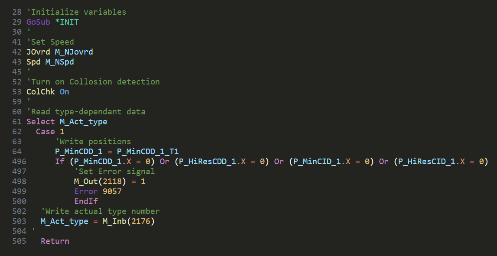

# MELFA language support for Highlight.js

*I appreciate any feedback on the colour scheme.*

[](https://twitter.com/zserub)
[](https://ko-fi.com/metaphysix)

*Check out my [MELFA extension for VS Code](https://github.com/zserub/MELFA-Basic)*

<br>



## Usage

Detailed information on [Highlight.js](https://highlightjs.org/)

### Online usage for HTMLs

Check [examples](https://github.com/zserub/MELFA-highlight.js/blob/main/examples/online_test.html)

```html
<link rel="stylesheet" href="https://zserub.github.io/MELFA-highlight.js/dist/melfa_dark.min.css">
<pre><code class="language-melfa">
    'your code here
</code></pre>
    <script src="https://cdnjs.cloudflare.com/ajax/libs/highlight.js/11.9.0/highlight.min.js"></script>
    <script src="https://zserub.github.io/MELFA-highlight.js/dist/melfa.min.js"></script>
    <script>hljs.highlightAll();</script>
```

### Offline usage for HTMLs

Download `dist/melfa.min.js` and `melfa_dark.min.css`

```html
<link rel="stylesheet" href="/path/to/melfa_dark.min.css">
<pre><code class="language-melfa">
    'your code here
</code></pre>
    <script src="https://cdnjs.cloudflare.com/ajax/libs/highlight.js/11.9.0/highlight.min.js"></script>
    <script src="/path/to/melfa.min.js"></script>
    <script>hljs.highlightAll();</script>
```